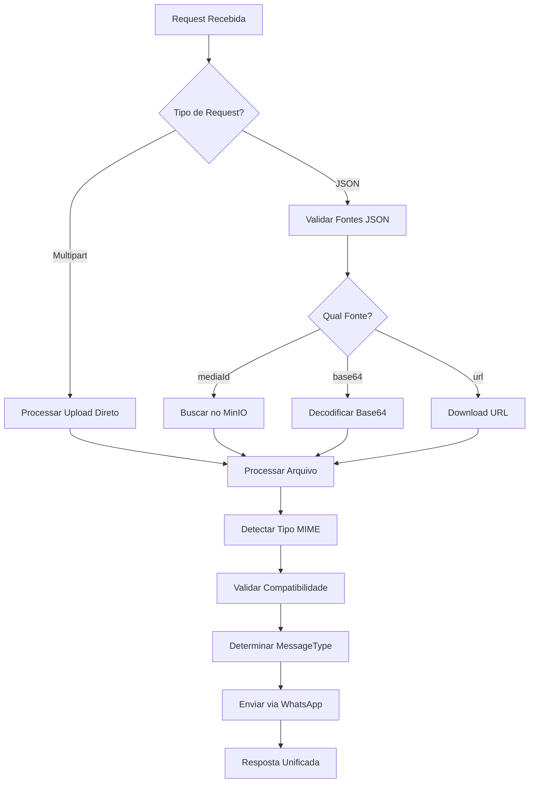

# 📱 WAMEX - Planejamento: Rota Multi-Source para Envio de Mídia

## 🎯 **Objetivo**

Expandir a rota `POST /message/{sessionID}/send/media` para aceitar **múltiplas fontes de mídia** com **detecção automática de tipo**, tornando-a uma solução universal para envio de qualquer tipo de mídia via WhatsApp.

---

## 🔄 **Fontes de Mídia Suportadas**

### **1. MinIO ID** *(Atual - Já Implementado)*
```json
{
  "phone": "5511999999999",
  "mediaId": "4a5347eb-33c5-4048-babc-0661cbba1b9b",
  "caption": "Mídia do MinIO"
}
```

### **2. Base64 Data URL**
```json
{
  "phone": "5511999999999",
  "base64": "data:image/jpeg;base64,/9j/4AAQSkZJRgABAQAAAQ...",
  "caption": "Imagem em base64"
}
```

### **3. URL Pública**
```json
{
  "phone": "5511999999999",
  "url": "https://example.com/image.jpg",
  "caption": "Imagem de URL pública"
}
```

### **4. Upload Direto (Multipart)**
```http
POST /message/{sessionID}/send/media
Content-Type: multipart/form-data

- file: [arquivo selecionado]
- phone: 5511999999999
- caption: Arquivo enviado diretamente
```

---

## 🧠 **Detecção Automática de Tipo**

### **Fluxo de Detecção:**
1. **Magic Numbers** - Análise dos primeiros 512 bytes
2. **MIME Type** - Detecção via `http.DetectContentType()`
3. **Extensão** - Fallback baseado na extensão do arquivo
4. **Validação WhatsApp** - Verificação de compatibilidade

### **Tipos Detectados Automaticamente:**
- 🖼️ **Imagem:** JPEG, PNG, GIF, WebP
- 🎵 **Áudio:** MP3, OGG, AAC, AMR, WAV
- 🎬 **Vídeo:** MP4, 3GP
- 📄 **Documento:** PDF, DOC, DOCX, XLS, XLSX, PPT, PPTX, TXT
- 🎭 **Sticker:** WebP (dimensões específicas)

---

## 🏗️ **Arquitetura da Solução**

### **1. Request Structure Unificada**
```go
type SendMediaMessageRequest struct {
    BaseMessageRequest
    
    // Múltiplas fontes (apenas uma deve ser fornecida)
    MediaID  string `json:"mediaId,omitempty"`  // MinIO ID existente
    Base64   string `json:"base64,omitempty"`   // Data URL base64
    URL      string `json:"url,omitempty"`      // URL pública
    // File via multipart será tratado separadamente
    
    // Metadados opcionais
    Caption     string `json:"caption,omitempty"`
    MessageType string `json:"messageType,omitempty"` // Override manual
    Filename    string `json:"filename,omitempty"`    // Nome customizado
}
```

### **2. Fluxo de Processamento**



### **3. Componentes Necessários**

#### **MediaSourceProcessor**
```go
type MediaSourceProcessor struct {
    mediaRepo       *repository.MediaRepository
    minioClient     *storage.MinIOClient
    validationSvc   *service.MediaValidationService
    sourceService   *service.MediaSourceService
}

func (p *MediaSourceProcessor) ProcessRequest(req *SendMediaMessageRequest, file multipart.File, header *multipart.FileHeader) (*ProcessedMedia, error)
```

#### **AutoTypeDetector**
```go
type AutoTypeDetector struct{}

func (d *AutoTypeDetector) DetectFromData(data []byte, filename string) (domain.MessageType, string, error)
func (d *AutoTypeDetector) ValidateForWhatsApp(messageType domain.MessageType, mimeType string) error
```

---

## 🔧 **Implementação Detalhada**

### **Fase 1: Estrutura Base**
1. ✅ **Expandir SendMediaMessageRequest** - Adicionar campos para múltiplas fontes
2. ✅ **Criar MediaSourceProcessor** - Processador unificado de fontes
3. ✅ **Implementar AutoTypeDetector** - Detecção automática robusta

### **Fase 2: Processamento de Fontes**
1. ✅ **Base64 Processing** - Integrar com sistema existente
2. ✅ **URL Download** - Implementar download seguro de URLs
3. ✅ **Multipart Upload** - Processar uploads diretos
4. ✅ **MinIO Integration** - Manter compatibilidade atual

### **Fase 3: Validação e Envio**
1. ✅ **Unified Validation** - Validação consistente para todas as fontes
2. ✅ **WhatsApp Integration** - Envio baseado no tipo detectado
3. ✅ **Error Handling** - Tratamento de erros específicos por fonte

---

## 📋 **Casos de Uso Suportados**

### **1. Envio Rápido (MinIO ID)**
```bash
# Upload prévio
POST /media/upload → mediaId: "abc123"

# Envio rápido
POST /message/teste/send/media
{
  "phone": "5511999999999",
  "mediaId": "abc123"
}
```

### **2. Envio Direto (Base64)**
```bash
POST /message/teste/send/media
{
  "phone": "5511999999999",
  "base64": "data:image/jpeg;base64,/9j/4AAQ..."
}
```

### **3. Envio de URL Externa**
```bash
POST /message/teste/send/media
{
  "phone": "5511999999999",
  "url": "https://example.com/document.pdf"
}
```

### **4. Upload e Envio Simultâneo**
```bash
POST /message/teste/send/media
Content-Type: multipart/form-data

- file: [arquivo]
- phone: 5511999999999
- caption: "Enviado diretamente"
```

---

## 🛡️ **Validações e Segurança**

### **Validações por Fonte:**
- **MinIO ID:** Verificar existência e expiração
- **Base64:** Validar formato Data URL e tamanho
- **URL:** Verificar domínios permitidos e timeout
- **Upload:** Validar magic numbers e limites

### **Segurança:**
- **Rate Limiting** por sessão e IP
- **Whitelist de domínios** para URLs externas
- **Scan de malware** para uploads diretos
- **Validação de tamanho** por tipo de mídia

---

## 📊 **Estrutura de Resposta Unificada**

```json
{
  "success": true,
  "message": "Media message sent successfully",
  "timestamp": "2025-07-13T19:48:08Z",
  "details": {
    "phone": "5511999999999",
    "type": "image",
    "status": "sent",
    "sentAt": "2025-07-13T19:48:08Z",
    "sessionName": "teste",
    "source": "base64",
    "mediaInfo": {
      "filename": "image.jpg",
      "mimeType": "image/jpeg",
      "originalSize": 1024000,
      "detectedType": "image",
      "processingTime": "245ms"
    },
    "whatsappInfo": {
      "messageId": "3EB0CA5F091171BDE7E085",
      "directPath": "/v/t62.7114-24/...",
      "url": "https://mmg.whatsapp.net/..."
    }
  }
}
```

---

## 🧪 **Testes Abrangentes**

### **Cenários de Teste:**
1. **Múltiplas Fontes** - Cada tipo de fonte individualmente
2. **Detecção Automática** - Todos os tipos MIME suportados
3. **Validações** - Arquivos inválidos e limites
4. **Performance** - Uploads grandes e timeouts
5. **Integração** - Fluxo completo end-to-end

### **Arquivo de Testes:**
```
tests/media-multi-source-tests.http
```

---

## 🚀 **Benefícios da Solução**

### **Para Desenvolvedores:**
- ✅ **API Unificada** - Uma rota para todas as necessidades
- ✅ **Detecção Automática** - Menos configuração manual
- ✅ **Flexibilidade** - Múltiplas formas de envio
- ✅ **Compatibilidade** - Mantém funcionalidade atual

### **Para Usuários:**
- ✅ **Simplicidade** - Envio intuitivo de qualquer mídia
- ✅ **Performance** - Otimizado para cada tipo de fonte
- ✅ **Confiabilidade** - Validações robustas
- ✅ **Versatilidade** - Suporte a todos os casos de uso

---

## 📈 **Roadmap de Implementação**

### **Sprint 1: Base Architecture** *(3 dias)*
- Expandir estruturas de request
- Implementar MediaSourceProcessor
- Criar AutoTypeDetector

### **Sprint 2: Source Processing** *(5 dias)*
- Implementar processamento de Base64
- Adicionar download de URLs
- Integrar upload multipart

### **Sprint 3: Integration & Testing** *(3 dias)*
- Integrar com WhatsApp Service
- Criar testes abrangentes
- Documentar API completa

### **Sprint 4: Security & Performance** *(2 dias)*
- Implementar validações de segurança
- Otimizar performance
- Deploy e monitoramento

---

**Total: ~13 dias para implementação completa da solução multi-source universal! 🎯**
