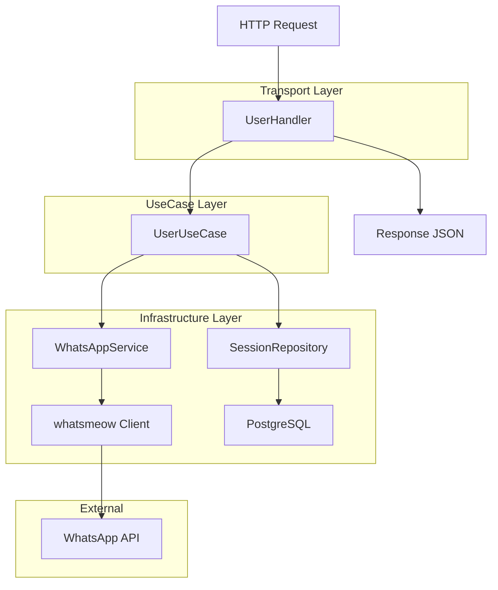

# 🏗️ Plano de Implementação - Funcionalidades Wuzapi para WAMEX

## Contexto

### Problema
O projeto WAMEX possui uma base sólida de funcionalidades WhatsApp, mas carece de recursos avançados presentes no projeto Wuzapi, como gerenciamento de usuários, grupos, webhooks e funcionalidades de chat avançadas.

### Objetivo
Implementar funcionalidades do Wuzapi no WAMEX mantendo a arquitetura Clean Architecture existente, padrões de nomenclatura e estrutura organizacional já estabelecidos.

### Restrições
- **Arquitetura**: Manter Clean Architecture (Domain → UseCase → Infrastructure → Transport)
- **Padrões**: Seguir convenções WAMEX existentes
- **Compatibilidade**: Não quebrar APIs existentes
- **Qualidade**: Cada fase deve compilar e funcionar antes da próxima
- **Testes**: Implementar testes unitários para cada componente

## Análise Comparativa

### ✅ Funcionalidades já implementadas no WAMEX
- Session management (connect, disconnect, status, qr, pairphone)
- Basic messaging (text, image, audio, document, video)
- Advanced messaging (sticker, location, contact, react, poll, list, edit)
- Media management (upload, download, list, delete)
- Middleware de resolução de sessão
- Logging estruturado
- Tratamento de erros padronizado

### 🆕 Funcionalidades do Wuzapi para implementar
- Contact management (check, info, avatar, list) - **Contatos de uma sessão**
- Session presence (available, unavailable, composing, etc.) - **Status da sessão**
- Chat management (delete, markread, presence) - **Gerenciamento de conversas**
- Group management (create, list, info, participants, etc.) - **Grupos da sessão**
- Webhook management - **Notificações de eventos**
- Advanced features (proxy, S3, newsletter) - **Recursos avançados**

## Alternativas Avaliadas

### Opção 1: Implementação Monolítica
- **Prós**: Implementação rápida, menos complexidade inicial
- **Contras**: Viola princípios SOLID, dificulta manutenção futura
- **Complexidade**: Baixa

### Opção 2: Implementação por Módulos Separados
- **Prós**: Separação clara de responsabilidades, facilita testes
- **Contras**: Maior complexidade inicial, mais arquivos
- **Complexidade**: Média

### Opção 3: Implementação Incremental seguindo Clean Architecture
- **Prós**: Mantém padrões existentes, facilita evolução, testável
- **Contras**: Mais tempo de implementação inicial
- **Complexidade**: Média-Alta

## Recomendação

**Solução escolhida**: Opção 3 - Implementação Incremental seguindo Clean Architecture

**Justificativa**:
- Mantém consistência com arquitetura existente
- Facilita manutenção e evolução futura
- Permite implementação e validação por fases
- Reutiliza infraestrutura existente (middleware, logging, etc.)
- Segue princípios SOLID e dependency rule

## Plano de Implementação

### 🎯 Fase 1: Contact & Presence Management (Prioridade Alta)
**Duração estimada**: 2-3 dias
**Objetivo**: Implementar funcionalidades de gerenciamento de contatos e presença da sessão

#### Funcionalidades
```
POST /contact/{sessionID}/check     - Verificar se número está no WhatsApp
POST /contact/{sessionID}/info      - Obter informações de um contato
POST /contact/{sessionID}/avatar    - Obter avatar de um contato
GET  /contact/{sessionID}/list      - Listar contatos da sessão
POST /session/{sessionID}/presence  - Definir status de presença da sessão
```

#### Estrutura de Implementação (Seguindo Regras WAMEX)
1. **Domain Layer** (`internal/domain/`)
   - `entity/contact.go` - Entidades ContactInfo, ContactPresence (com tags bun/json)
   - `service/whatsapp.go` - Extensão da interface SessionService existente
   - **CONCEITO**: Session = conexão WhatsApp, Contact = outros números

2. **UseCase Layer** (`internal/usecase/`)
   - `contact/check_contact.go` - CheckContactUseCase
   - `contact/get_contact_info.go` - GetContactInfoUseCase
   - `contact/get_contact_avatar.go` - GetContactAvatarUseCase
   - `contact/list_contacts.go` - ListContactsUseCase
   - `session/set_presence.go` - SetSessionPresenceUseCase
   - **Nomenclatura**: `{Acao}{Recurso}UseCase`

3. **Infrastructure Layer** (`internal/infra/`)
   - `whatsapp/whatsapp_service.go` - Extensão com métodos de contato/presença
   - **IMPORTANTE**: Não criar serviço separado, estender o existente

4. **Transport Layer** (`internal/transport/`)
   - `http/handler/contact.go` - ContactHandler
   - `http/handler/session.go` - Extensão com método de presença
   - `http/router/router.go` - Extensão com rotas /contact
   - **Padrão**: Usar middleware SessionResolver existente

#### Critérios de Aceitação
- [ ] Todas as rotas respondem corretamente
- [ ] Validação de entrada implementada
- [ ] Tratamento de erros padronizado
- [ ] Logging estruturado
- [ ] Testes unitários implementados
- [ ] Build compila sem erros

### 🎯 Fase 2: Chat Management (Prioridade Alta)
**Duração estimada**: 2 dias
**Objetivo**: Implementar funcionalidades avançadas de chat

#### Funcionalidades
```
POST /chat/{sessionID}/delete     - Deletar mensagens enviadas
POST /chat/{sessionID}/markread   - Marcar mensagens como lidas
POST /chat/{sessionID}/presence   - Definir presença em chat (typing, recording)
```

#### Estrutura de Implementação
1. **Domain Layer**
   - `internal/domain/entity/chat.go` - Entidades ChatPresence, DeleteMessage
   - Extensão de interfaces existentes

2. **UseCase Layer**
   - `internal/usecase/chat/delete_message.go`
   - `internal/usecase/chat/mark_read.go`
   - `internal/usecase/chat/set_chat_presence.go`

3. **Infrastructure Layer**
   - Extensão do WhatsApp service existente

4. **Transport Layer**
   - `internal/transport/http/handler/chat.go`
   - Extensão do router

### 🎯 Fase 3: Group Management (Prioridade Média)
**Duração estimada**: 4-5 dias
**Objetivo**: Implementar gerenciamento completo de grupos

#### Funcionalidades
```
POST /group/{sessionID}/create           - Criar grupos
GET  /group/{sessionID}/list             - Listar grupos
POST /group/{sessionID}/info             - Obter informações do grupo
GET  /group/{sessionID}/invitelink       - Gerar/obter link de convite
POST /group/{sessionID}/photo            - Definir foto do grupo
POST /group/{sessionID}/leave            - Sair do grupo
POST /group/{sessionID}/join             - Entrar no grupo via link
POST /group/{sessionID}/participants     - Gerenciar participantes
```

#### Estrutura de Implementação
1. **Domain Layer**
   - `internal/domain/entity/group.go`
   - `internal/domain/service/group.go`

2. **UseCase Layer**
   - `internal/usecase/group/` - Múltiplos use cases

3. **Infrastructure Layer**
   - Implementação GroupService

4. **Transport Layer**
   - `internal/transport/http/handler/group.go`

### 🎯 Fase 4: Webhook Management (Prioridade Média)
**Duração estimada**: 2-3 dias
**Objetivo**: Implementar sistema de webhooks

#### Funcionalidades
```
POST   /webhook/{sessionID}        - Configurar webhook
GET    /webhook/{sessionID}        - Obter configuração webhook
PUT    /webhook/{sessionID}        - Atualizar webhook
DELETE /webhook/{sessionID}        - Remover webhook
```

### 🎯 Fase 5: Advanced Features (Prioridade Baixa)
**Duração estimada**: 3-4 dias
**Objetivo**: Implementar funcionalidades avançadas

#### Funcionalidades
- Configuração de proxy
- Integração S3
- Gerenciamento de newsletters
- Downloads específicos por tipo de mídia

## Riscos e Mitigações

### Risco 1: Complexidade da API WhatsApp
**Descrição**: Algumas funcionalidades podem não estar disponíveis na versão atual do whatsmeow
**Mitigação**: 
- Verificar documentação do whatsmeow antes da implementação
- Implementar fallbacks ou mensagens de "não implementado"
- Manter interfaces preparadas para implementação futura

### Risco 2: Breaking Changes
**Descrição**: Alterações podem quebrar funcionalidades existentes
**Mitigação**:
- Implementar testes de regressão
- Validar build a cada fase
- Manter versionamento de API

### Risco 3: Performance
**Descrição**: Novas funcionalidades podem impactar performance
**Mitigação**:
- Implementar cache onde apropriado
- Monitorar métricas de performance
- Implementar rate limiting

### Risco 4: Segurança
**Descrição**: Novas endpoints podem introduzir vulnerabilidades
**Mitigação**:
- Validação rigorosa de entrada
- Autenticação/autorização adequada
- Logging de segurança

## Critérios de Sucesso

### Técnicos
- [ ] Todas as funcionalidades implementadas conforme especificação
- [ ] Cobertura de testes > 80%
- [ ] Build pipeline verde
- [ ] Performance mantida ou melhorada
- [ ] Zero breaking changes

### Arquiteturais
- [ ] Clean Architecture mantida
- [ ] Padrões WAMEX seguidos
- [ ] Dependency rule respeitada
- [ ] Interfaces bem definidas
- [ ] Separação de responsabilidades clara

### Operacionais
- [ ] Documentação atualizada
- [ ] Logs estruturados implementados
- [ ] Métricas de monitoramento
- [ ] Tratamento de erros padronizado

## Próximos Passos

1. **Aprovação do plano** pela equipe
2. **Setup do ambiente** de desenvolvimento
3. **Implementação Fase 1** (User Management)
4. **Validação e testes** da Fase 1
5. **Iteração** para próximas fases

## Diagramas de Arquitetura

### Fluxo de Implementação - Fase 1 (User Management)



### Estrutura de Diretórios - Após Implementação (Seguindo Regras WAMEX)

```
internal/
├── domain/
│   ├── entity/
│   │   ├── session.go
│   │   ├── message.go
│   │   ├── media.go
│   │   ├── contact.go       # 🆕 Fase 1 (ContactInfo, ContactPresence)
│   │   ├── chat.go          # 🆕 Fase 2 (ChatAction, MessageDelete)
│   │   ├── group.go         # 🆕 Fase 3 (GroupInfo, GroupParticipant)
│   │   └── webhook.go       # 🆕 Fase 4 (WebhookConfig, WebhookEvent)
│   ├── service/
│   │   ├── whatsapp.go      # 🔄 Estendido com métodos contact/chat/group
│   │   └── media.go         # Mantido separado (já existe)
│   └── repository/
│       ├── session.go       # Existente (Session = conexão WhatsApp)
│       ├── media.go         # Existente
│       └── webhook.go       # 🆕 Fase 4 (se necessário persistência)
├── usecase/
│   ├── whatsapp/           # Existente (session management)
│   ├── media/              # Existente (media processing)
│   ├── contact/            # 🆕 Fase 1 (check_contact.go, get_contact_info.go, etc.)
│   ├── session/            # 🆕 Fase 1 (set_presence.go - presença da sessão)
│   ├── chat/               # 🆕 Fase 2 (delete_message.go, mark_read.go, etc.)
│   ├── group/              # 🆕 Fase 3 (create_group.go, list_groups.go, etc.)
│   └── webhook/            # 🆕 Fase 4 (manage_webhook.go)
├── infra/
│   ├── whatsapp/
│   │   └── whatsapp_service.go  # 🔄 Estendido (não criar arquivos separados)
│   ├── database/           # Existente
│   ├── storage/            # Existente
│   └── config/             # Existente
└── transport/
    └── http/
        ├── handler/
        │   ├── session.go   # 🔄 Estendido com set_presence
        │   ├── message.go   # Existente
        │   ├── media.go     # Existente
        │   ├── contact.go   # 🆕 Fase 1 (check, info, avatar, list)
        │   ├── chat.go      # 🆕 Fase 2 (delete, markread, presence)
        │   ├── group.go     # 🆕 Fase 3 (create, list, manage)
        │   └── webhook.go   # 🆕 Fase 4 (CRUD webhooks)
        └── router/
            └── router.go    # 🔄 Estendido com novas rotas
```

## Especificações Técnicas Detalhadas

### Fase 1: User Management - Especificação de APIs

#### POST /user/{sessionID}/check
```json
// Request
{
  "phone": "5511999999999"
}

// Response
{
  "success": true,
  "message": "User check completed",
  "phone": "5511999999999",
  "is_on_whatsapp": true,
  "jid": "5511999999999@s.whatsapp.net",
  "timestamp": "2025-01-14T10:30:00Z"
}
```

#### POST /user/{sessionID}/info
```json
// Request
{
  "phone": "5511999999999"
}

// Response
{
  "success": true,
  "message": "User info retrieved",
  "user": {
    "jid": "5511999999999@s.whatsapp.net",
    "phone_number": "5511999999999",
    "name": "João Silva",
    "business_name": "",
    "is_on_whatsapp": true,
    "is_business": false,
    "status": "Disponível",
    "avatar": "https://..."
  },
  "timestamp": "2025-01-14T10:30:00Z"
}
```

#### GET /user/{sessionID}/contacts
```json
// Response
{
  "success": true,
  "message": "Contacts retrieved",
  "contacts": [
    {
      "jid": "5511999999999@s.whatsapp.net",
      "name": "João Silva",
      "phone_number": "5511999999999",
      "is_business": false,
      "is_my_contact": true,
      "avatar": "https://..."
    }
  ],
  "total": 150,
  "timestamp": "2025-01-14T10:30:00Z"
}
```

### Padrões de Implementação

#### Estrutura de UseCase (Seguindo Padrões WAMEX)
```go
// Arquivo: internal/usecase/user/check_user.go
package user

import (
    "fmt"

    entity "wamex/internal/domain/entity"
    domainRepo "wamex/internal/domain/repository"
    domainService "wamex/internal/domain/service"
)

type CheckUserUseCase struct {
    sessionRepo    domainRepo.SessionRepository
    whatsappService domainService.SessionService  // Usar interface existente
}

func NewCheckUserUseCase(
    sessionRepo domainRepo.SessionRepository,
    whatsappService domainService.SessionService,
) *CheckUserUseCase {
    return &CheckUserUseCase{
        sessionRepo:    sessionRepo,
        whatsappService: whatsappService,
    }
}

func (uc *CheckUserUseCase) Execute(sessionName, phone string) (*entity.UserInfo, error) {
    // 1. Validar sessão
    session, err := uc.sessionRepo.GetBySession(sessionName)
    if err != nil {
        return nil, fmt.Errorf("failed to get session: %w", err)
    }

    if session.Status != entity.StatusConnected {
        return nil, fmt.Errorf("session %s is not connected", sessionName)
    }

    // 2. Verificar usuário (método estendido na interface SessionService)
    userInfo, err := uc.whatsappService.CheckUser(sessionName, phone)
    if err != nil {
        return nil, fmt.Errorf("failed to check user: %w", err)
    }

    return userInfo, nil
}
```

#### Estrutura de Handler
```go
func (h *UserHandler) CheckUser(w http.ResponseWriter, r *http.Request) {
    sessionID := chi.URLParam(r, "sessionID")

    var req entity.UserCheckRequest
    if err := json.NewDecoder(r.Body).Decode(&req); err != nil {
        h.writeErrorResponse(w, http.StatusBadRequest, "Invalid request body", err)
        return
    }

    // Validação
    if req.Phone == "" {
        h.writeErrorResponse(w, http.StatusBadRequest, "Phone is required", nil)
        return
    }

    // Executar use case
    userInfo, err := h.checkUserUseCase.Execute(sessionID, req.Phone)
    if err != nil {
        h.writeErrorResponse(w, http.StatusInternalServerError, "Failed to check user", err)
        return
    }

    // Resposta
    response := entity.UserCheckResponse{
        Success:      true,
        Message:      "User check completed",
        Phone:        req.Phone,
        IsOnWhatsApp: userInfo.IsOnWhatsApp,
        JID:          userInfo.JID,
        Timestamp:    time.Now(),
    }

    h.writeJSONResponse(w, http.StatusOK, response)
}
```

## Cronograma Detalhado

### Semana 1: Fase 1 - Contact & Presence Management
- **Dia 1**: Domain entities (contact.go) e extensão de interfaces
- **Dia 2**: Use cases (contact/ e session/set_presence.go)
- **Dia 3**: Infrastructure (extensão whatsapp_service.go)
- **Dia 4**: Transport layer (contact.go handler, extensão session.go)
- **Dia 5**: Testes de integração e documentação

### Semana 2: Fase 2 - Chat Management
- **Dia 1-2**: Implementação completa
- **Dia 3**: Testes e validação
- **Dia 4-5**: Fase 3 início (Group Management)

### Semana 3-4: Fase 3 - Group Management
- Implementação completa de todas as funcionalidades de grupo

### Semana 5: Fase 4 - Webhook Management
- Sistema completo de webhooks

### Semana 6: Fase 5 - Advanced Features
- Funcionalidades avançadas e polimento

---

**Observação**: Este plano segue os princípios arquiteturais do WAMEX e pode ser ajustado conforme necessidades específicas ou descobertas durante a implementação.
